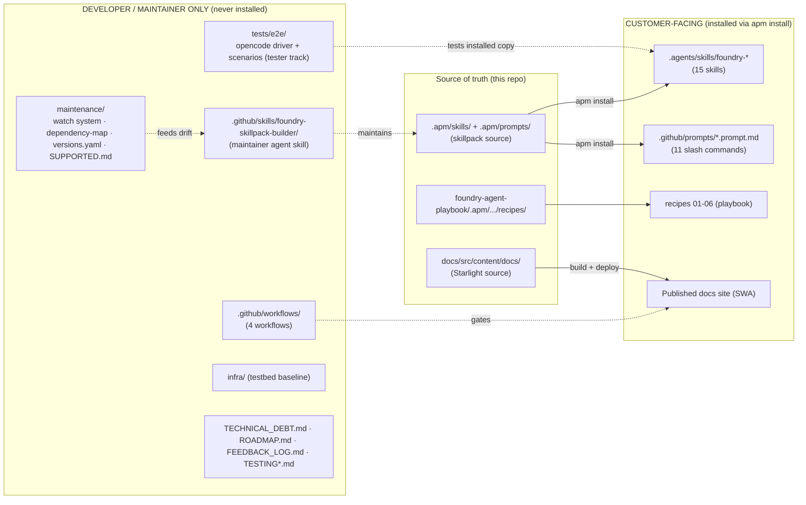
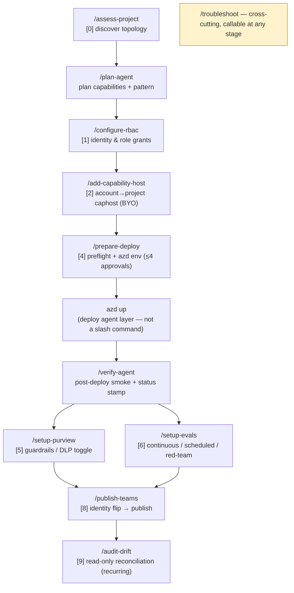
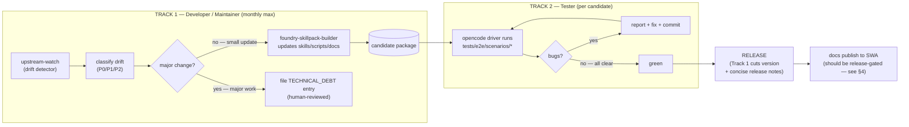
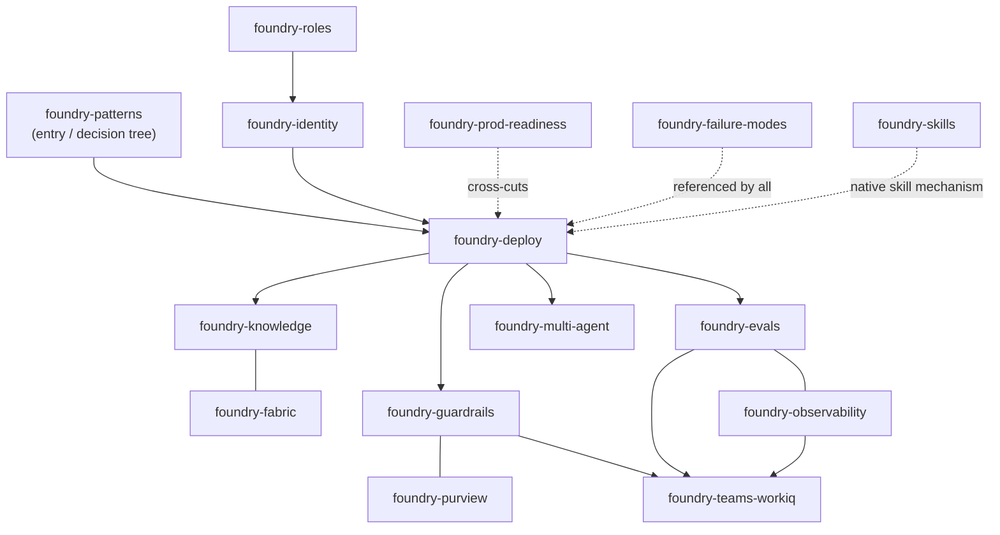
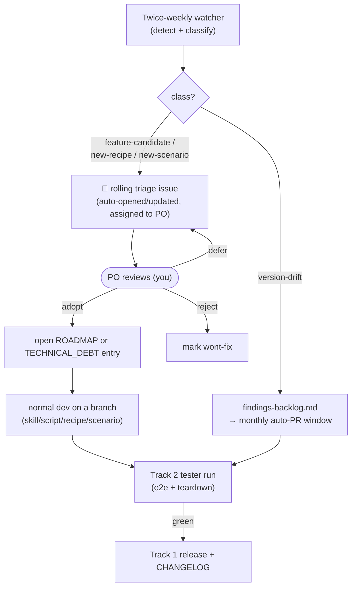

<!--
  MAINTAINER / CI-ONLY ARTIFACT — DO NOT MOVE UNDER .apm/ AND DO NOT SHIP TO CONSUMERS.
  Audience: repo maintainers + the developer/tester agents that build and maintain this
  skillpack. NOT customer-facing. The customer-facing equivalents are the docs site
  (docs/src/content/docs/) and the installed slash commands.

  Companions: foundry-dependency-map.md (deep build-order + ripple detail),
  watch-inventory.md (what the watcher tracks), SUPPORTED.md, versions.yaml.
-->

# Automation Tracks, Slash-Command Sequence & Codebase Segregation

This is the single map of **who runs what, in what order, and which half of the repo it
touches**. It answers four maintainer questions:

1. Which files does a **customer** consume vs. which files are **developer/maintainer-only**? (§1)
2. In what **order** do the slash commands run during an automated build? (§2)
3. How do the **two automation tracks** (developer/maintainer loop + tester loop) form a release gate? (§3)
4. Where does **docs publishing** sit, and what is wrong with it today? (§4)

> Visual companion for skill interdependency + overlap is in §5. Deep ripple/version detail
> stays in [`foundry-dependency-map.md`](./foundry-dependency-map.md).

---

## 1. Codebase segregation — customer code vs. developer/maintainer agents

There are **two codebases in one repo**. Everything that ships to a customer flows through
`apm install`; everything else exists only to build, test, and maintain that shipped surface.

**Rule of thumb:** if a path is under `.apm/`, the playbook `recipes/`, or `docs/src/`, it is
**customer code** (the first two get copied into `.agents/`/`.github/prompts/` on install; the
third becomes the public site). Everything under `maintenance/`, `tests/`, `infra/`,
`.github/skills/`, `.github/workflows/`, and the root governance markdown is **developer-only**
and must never be referenced from a shipped skill or prompt.

| Concern | Customer-facing | Developer/maintainer-only |
|---|---|---|
| Skills | `.agents/skills/foundry-*` (from `.apm/skills/`) | `.github/skills/foundry-skillpack-builder/` |
| Commands | `.github/prompts/*.prompt.md` (the 11) | — (commands are run *by* the agent, defined as customer surface) |
| Scenarios | playbook `recipes/01-06` + docs `recipes/` | `tests/e2e/scenarios/*.yaml` (executable test of those recipes) |
| Freshness | (none — customer trusts the release) | `maintenance/watch/*`, `dependency-map.md`, `versions.yaml`, `SUPPORTED.md` |
| Infra | (customer brings their own) | `infra/` (testbed only) |

---

## 2. Slash-command execution sequence (automation order)

There is **no single command** — a real build is a *sequence*, and the sequence is derived
from the build-order graph in [`foundry-dependency-map.md`](./foundry-dependency-map.md)
(stages `[0]`–`[9]`). The 11 commands map onto that order:

**Notes for the automation harness:**

- `/assess-project` caches `assessment/project-topology.json`; every downstream command reads
  that cache instead of re-discovering (single source of truth for the run).
- Guardrails `[5]` and evals `[6]` are **parallelizable** after `/verify-agent` (no ordering
  dependency between them); both must complete before `/publish-teams`.
- `/audit-drift` is the only command meant to run **on a schedule** post-build (recipe 02 § Step 9).
- `/troubleshoot` is not in the linear sequence — it is invoked on any non-zero exit and reads
  the failing stage's `RECOVERY=` line.

> The customer never has to memorize this graph — the **recipes** (`docs/.../recipes/01-06`)
> encode the exact command sequence for each starting point. This section is the *maintainer's*
> view of why the recipes are ordered the way they are.

---

## 3. The two-track agent loop (developer/maintainer + tester → release gate)

The skillpack is maintained by **two automation tracks** that together form a release gate.
A version is only cut when the tester track is green.

**Track 1 — Developer / Maintainer.** Looks for the latest information the skills need, updates
them, and either packages a release **or** — for major development — records a technical-debt
item for human review. **Cadence target: once a month, maximum.** *Implemented:* `upstream-watch.yml`
keeps **detection** twice weekly (Tue + Fri, report-only) but adds a **monthly apply/package
review window** (1st-of-month cron). Every scheduled run also opens/updates a single rolling
**triage issue** for the PO (§7) — so detection is fast, applying is monthly, and new features are
human-gated. The `mode=apply` rolling-PR path is still stubbed (lands incrementally).

**Track 2 — Tester.** Takes the updated/candidate skills and runs them against the **test env**
(`tests/e2e/` opencode harness against the `agentskillpack-testbed-rg` testbed), reports bugs,
fixes them, and commits. **Only when all bugs are cleared does Track 1 release the package.**
*Implemented:* wired as `.github/workflows/e2e-test.yml` — manual dispatch + monthly pre-release
cron, pinned to the protected `e2e-testbed` environment (PO approval gate), and a **mandatory
teardown** step (`if: always()` → `infra/cleanup-sweep.sh --apply`) that deletes the ephemeral
Foundry agent resources on every outcome (pass / fail / cancel). `apm-install-test.yml` remains
the lighter install smoke test that runs on PRs.

**Technical debt is the human-in-the-loop valve.** Anything Track 1 cannot safely auto-apply
becomes a `TECHNICAL_DEBT.md` entry that maintainers review periodically (e.g. TD-28 cross-OS
scripts, TD-35 LangGraph observability/eval coverage).

---

## 4. Docs publishing & release gating — current state vs. intended (PO decision)

**Intended (per product owner):** after a package release, any necessary docs update is made and
*then* the workflow publishes the docs site. Docs should **not** publish on every commit.

**Implemented (`.github/workflows/docs.yml`):**

| Aspect | Before | Now |
|---|---|---|
| Production trigger | `push` to **`main`** (paths-filtered) | **`release: [published]`** + `workflow_dispatch` (manual republish) |
| PR behaviour | preview deploy + drift check | unchanged (preview + drift check on PRs) |
| Gate | none — every qualifying main push deployed to SWA | **release-gated** — docs are now a release artifact |

The docs site now publishes **only after a package release** (or an explicit manual dispatch for a
docs-only hotfix), matching Track 1's release step in §3. PRs still get an ephemeral preview and
the docs↔skillpack drift check, so contributors keep fast feedback without touching production.

> ⚠️ **Notify the PO** whenever automation diverges from this model (wrong trigger scope,
> tester track skipped, release cut with red tests, docs published ahead of a release).

---

## 5. Skill interdependency & overlap (developer/tester view)

Fifteen `foundry-*` skills, but they are **not independent** — several share surfaces and can
overlap (the same Learn doc or script feeds more than one). This view exists so a maintainer
editing one skill knows the blast radius.

**Known overlaps (where edits ripple to a sibling skill):**

| Surface | Primary skill | Overlapping skill(s) | Shared artifact |
|---|---|---|---|
| RBAC / roles | `foundry-roles` | `foundry-identity`, every deploy script | `preflight-role.sh`, role matrix |
| Guardrails ↔ Purview DLP | `foundry-guardrails` | `foundry-purview` | L1.5 DLP middleware contract |
| Eval ↔ Observability | `foundry-evals` | `foundry-observability` | continuous-eval ↔ Agent Monitoring Dashboard |
| Knowledge ↔ Fabric | `foundry-knowledge` | `foundry-fabric` | `agent-capabilities.yaml` knowledge block |
| Failure modes | `foundry-failure-modes` | all | F-## codes referenced in `RECOVERY=` lines |
| Region/version constants | `foundry-evals` | `foundry-prod-readiness` | `SUPPORTED_REGIONS`, `versions.yaml` (P0 watch) |

> For the *exact* upstream-change → downstream-skill ripple, use the **Ripple table** in
> [`foundry-dependency-map.md`](./foundry-dependency-map.md). This table is the skill-to-skill
> overlap; that one is the doc/version-to-stage ripple.

---

## 6. Scenario test coverage (Track 2 backlog — item "all scenarios must be tested")

The recipes (§2) define customer command-sequences; the tester track must exercise each.
Eight scenarios are now authored under `tests/e2e/scenarios/` (the per-scenario command flow for
each is documented in [`tests/e2e/SCENARIO-FLOWS.md`](../tests/e2e/SCENARIO-FLOWS.md)). **"Authored"**
means the scenario YAML + assertions + teardown exist and pass static validation; **"live-green"**
means it has actually passed through the protected `e2e-testbed` run at least once. The two are
tracked separately because no live run has executed beyond the greenfield smoke yet.

To run the whole tester track in one shot, dispatch `e2e-test.yml` with **`all_scenarios: true`** —
it fans out to one job per scenario (matrix). Leave **`include_billable: false`** for a first sweep
to run only the free dry-run/read-only/offline/advisory scenarios (everything except `01`/`04`);
flip it on once those are green to add the two billable live deploys. Billable legs are serialized.

| Scenario file | Command path exercised | Recipe | Tier | Authored? | Live-green? |
|---|---|---|---|---|---|
| `01-greenfield.yaml` | assess → prepare-deploy → `azd up` → verify | 01 | live (deploy) | ✅ | ✅ (greenfield-live-3) |
| `02-setup-evals.yaml` | preflight-role → ensure_continuous_eval `--dry-run` → ensure_scheduled_eval `--dry-run` | 01/04 | dry-run | ✅ | ⏳ pending |
| `03-configure-rbac.yaml` | check-identities → grant-rbac `--dry-run` (Phase 1 + 2 plan) | (cmd) | dry-run | ✅ | ⏳ pending (live grant tier = TD-38) |
| `04-traces-evals.yaml` | scaffold (instrumented) → `azd up` → 5× Learn-MCP queries → ensure_continuous_eval (real) → App Insights + eval probes | 01 (obs/eval variant) | live (deploy + real eval) | ✅ | ⏳ pending (TD-35/TD-37) |
| `05-troubleshoot.yaml` | failure-modes catalog match (F-01) → write diagnosis | (cmd) | offline | ✅ | ⏳ pending |
| `06-prepare-deploy.yaml` | scaffold → /prepare-deploy preflight → STOP at azd-ready | (cmd) | read-only | ✅ | ⏳ pending |
| `07-audit-drift.yaml` | scaffold → /audit-drift read-only reconcile → report + stamp | (cmd) | read-only | ✅ | ⏳ pending |
| `08-setup-purview.yaml` | /setup-purview advisory brief + honest-limitations disclosure | (cmd) | advisory | ✅ | ⏳ pending |

**Still uncovered (no scenario authored yet — Track-2 backlog):**

| Gap | Recipe | Notes |
|---|---|---|
| Brownfield onboarding + drift baseline | 02 | bring-your-own code scan |
| Knowledge + Purview (KB MCP + Content Safety) | 03 | recipe-only |
| AI Search direct + scheduled eval (live) | 04 | scenario `02` only dry-runs the scheduled path |
| APIM-fronted MCP + per-source RBAC + drift | 05 | recipe-only |
| Multi-agent orchestration | 06 | recipe-only |
| add-capability-host lifecycle (create → verify → teardown) | (cmd) | **this phase** (TD-39) — expensive (Cosmos + Search + APIM); DELETE+recreate model |
| publish-teams | (cmd) | next phase |

Closing this table is the standing Track-2 backlog. Until a scenario is **live-green** here, its
recipe is "documented + statically validated, but not yet proven against live Foundry." A failing
live run now auto-files a finding on the rolling triage issue (the `e2e-test.yml` auto-finding step,
§3) so the gap is captured without a human transcribing the
[ITERATION-LOG](../tests/e2e/ITERATION-LOG.md).

### Prioritization (product-owner direction, 2026-06-26)

**This phase — must test:**

- **configure-rbac** (TD-38) — highest priority. The identity/role grants underpin *every* other
  scenario and component (eval-rule binding, capability-host data-plane roles, the agent MI). Tested
  across the agent scenarios, not in isolation.
- **Observability live — LangGraph** (TD-35 + TD-37) — **not a dry-run.** Deploy the
  `langgraph-chat-sample` fixture, trigger the agent, and confirm real traces land in Foundry
  observability (Agent Monitoring Dashboard + App Insights). Essential because LangGraph is the
  second-most-likely customer runtime.
- **add-capability-host lifecycle** (TD-39) — expensive (provisions Cosmos + AI Search + APIM), so a
  dedicated, manually-dispatched scenario with its own teardown. **Correction:** a capability host
  *can* be removed — the API has no in-place UPDATE, so the model is **DELETE + recreate**
  (`add-capability-host.sh --force-recreate` deletes, polls, then re-PUTs). We do **not** need to
  destroy the whole project to re-test; full cost teardown just deletes the project-scoped test
  resources (Cosmos/Search/APIM) that `cleanup-sweep.sh` tags.

**Next phase — deferred (tracked, not scheduled):** publish-teams (no scenario authored). Note
`audit-drift` and `setup-purview` are now **authored** as read-only/advisory scenarios
(`07-audit-drift.yaml`, `08-setup-purview.yaml`) and only await a live-green run.

**`troubleshoot`** is diagnostic-only — it matches a symptom to a fix from the **foundry-failure-modes**
catalog (F-01…F-24), plus a project-topology re-check and an App Insights KQL hook; **no Azure
mutation.** It is now authored as its own cheap offline scenario (`05-troubleshoot.yaml`) that drives a
synthetic symptom and asserts the right failure-mode id/fix (F-01, reserved env var) — no live run
needed.

---

## 7. Human-in-the-loop — adding new features/scenarios without disrupting the schedule

The twice-weekly watcher will surface things that are **not** simple version bumps: a brand-new
evaluator (e.g. **Rubric evaluation**), a new runtime to support as a recipe (e.g. **LangGraph as
a recipe tester**), or a new test scenario. These must **not** be auto-applied by the scheduled
run, but they must also not get lost. The mechanism is a **classification + rolling triage issue**:
detection stays fully automatic and non-blocking, while *adoption* is a deliberate human decision.

### The cadence is split into three independent clocks

| Clock | When | What it does | Blocks anything? |
|---|---|---|---|
| **Detect** | Twice weekly (Tue/Fri) | Hash docs + poll versions, classify drift, update the rolling triage issue | No — report-only |
| **Apply** | Monthly (1st) | Auto-PR-eligible **version-drift** only (after tester-track green) | Gated on tester track |
| **Adopt** | Any time, human-initiated | Convert a **feature-candidate** into a ROADMAP/TD item → dev → tester → release | Human decision |

Because they are separate, a new feature never stalls the detector and never sneaks into an
auto-apply. The scheduled job stays exactly as fast and as safe as before.

### Finding taxonomy (what the watcher does with each class)

| Class | Examples | Watcher action | Who decides |
|---|---|---|---|
| `version-drift` | pinned dep moved, api-version GA'd | logged in `findings-backlog.md`; eligible for the **monthly** auto-PR window | automation (after tests green) |
| `region/constant` | new eval region, renamed built-in | P0 re-check (see dependency-map §"Per-run freshness"); advisory, not a wall | automation + spot human review |
| **`feature-candidate`** | **Rubric evaluator**, new guardrail layer | **adds a checklist item to the rolling triage issue** — never applied | **PO** (you) |
| **`new-recipe` / `new-scenario`** | **LangGraph recipe tester**, new e2e scenario | **triage-issue checklist item** → becomes a `tests/e2e/scenarios/*.yaml` + recipe | **PO** (you) |

### The flow (where your input enters)

**Concretely, your loop is:**

1. The scheduled run opens (or updates) **one** issue titled *"🔭 Upstream drift triage (rolling)"*
   — implemented in `upstream-watch.yml` (the `actions/github-script` step). It carries the latest
   drift summary and a triage checklist; it never spams (find-or-create on a hidden marker).
2. You skim it on your own schedule. For a **feature-candidate** (Rubric) or a **new recipe/scenario**
   (LangGraph tester), you tick the box and open a one-line ROADMAP or `TECHNICAL_DEBT.md` entry
   (e.g. TD-35 is exactly this kind of human-gated item).
3. That entry is picked up as **normal development** on a branch — not by the scheduled job. The
   tester track validates it; only then does it ship in a release with a CHANGELOG note.
4. Pure version-drift needs none of this — it flows through the monthly apply window automatically
   once the tester track is green.

**Why this is the right shape:** the schedule owns *detection* (cheap, frequent, safe); humans own
*adoption* (judgement, scope, sequencing); the tester track owns *correctness* (the release gate).
No new feature can change shipped behaviour without passing through your triage and a green test
run, and the twice-weekly job is never blocked waiting on a decision.

